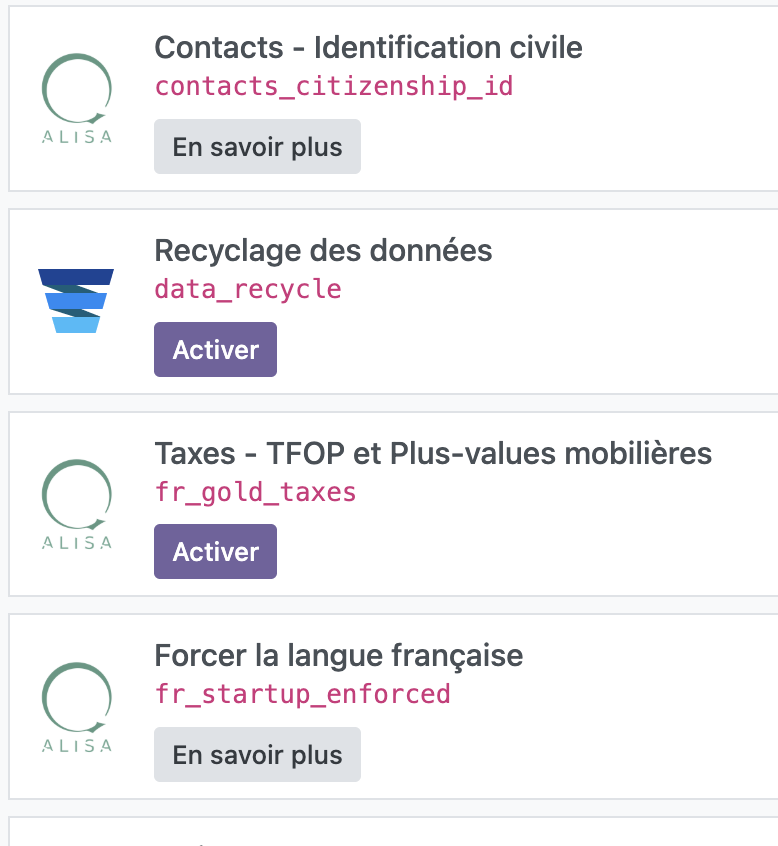

# Addons
Assurez-vous que les modules suivants sont disponibles à l'installation sur votre logiciel Odoo:

## Qalisa - Modules maison https://github.com/Qalisa/odoo-apps/tree/18-0/addons
- fr_startup_enforced
- contacts_citizenship_id
- fr_gold_taxes

## Qalisa - Modules traduits / customisés https://github.com/Qalisa/odooapps
- om_account_accountant

# 1ère configuration
:::tip
Si l'option "Multi-établissement" doit être activée, activez-la au bon moment; 
Faites le paramétrage qui sera appliqué à TOUTES les structures de votre entreprise en 1er, puis celles spécifiques à certaines
APRèS. Cela vous économisera des opérations de redite chronophages.
:::

- Décocher "autocompletion des partenaires" (Menu > Paramètres > Paramètres Généraux > Contacts)
- Désactiver 

## Post pre-installation

## 

:::tip
Malheureusement, la base de données par défaut
:::

Plan Fiscal > FR

##
