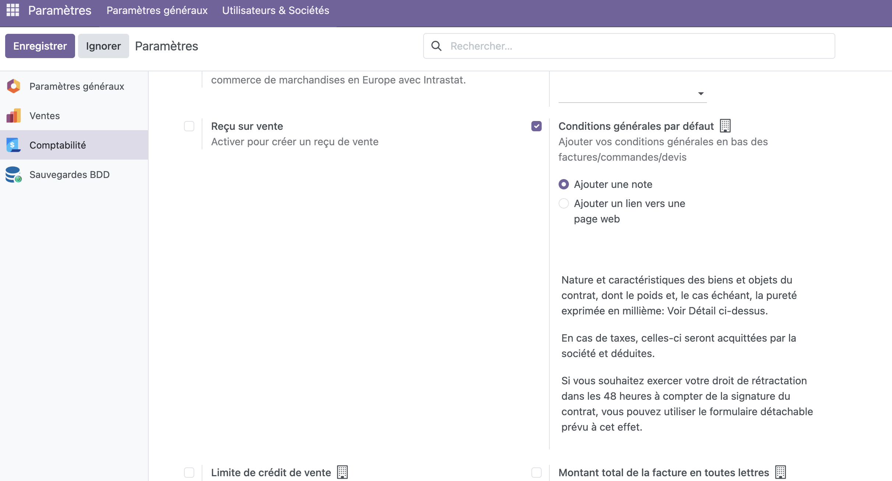
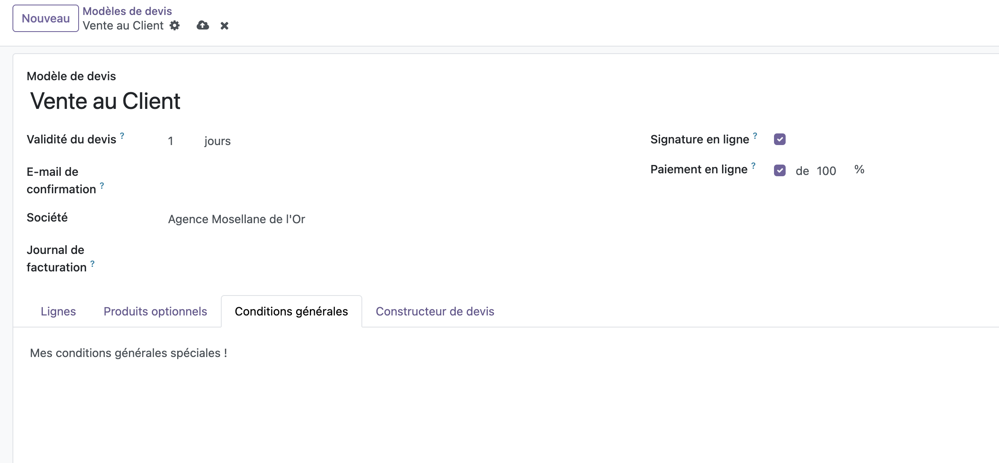
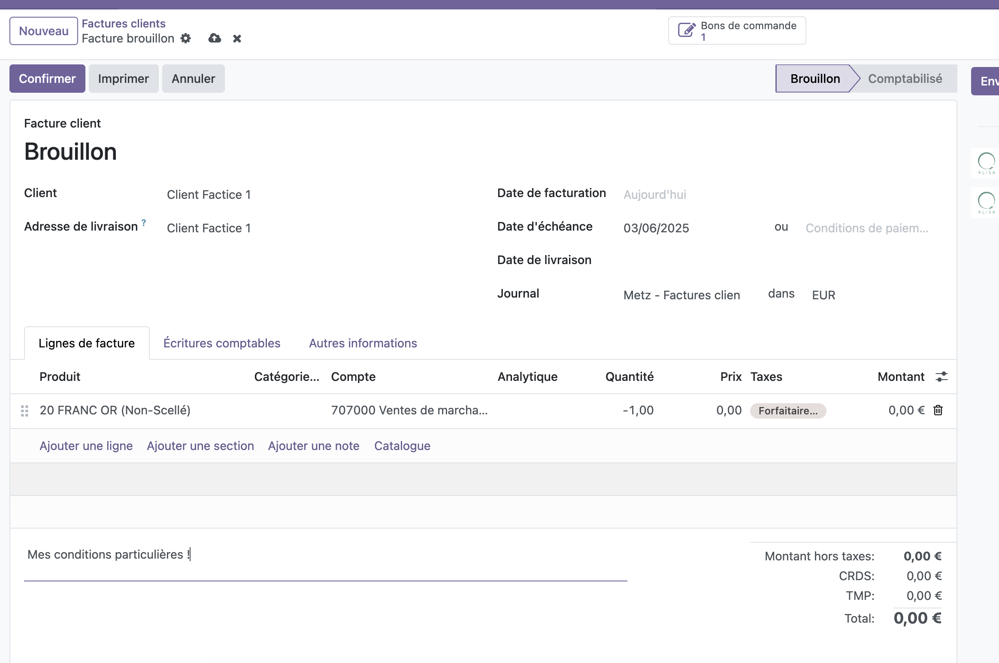

Plusieurs façons de gérer ses conditions de vente:

## Sur tous les documents, au niveau de l'entreprise

Rendez-vous dans `Menu > Paramètres > Comptabilité > Factures Clients > Conditions générales par défaut`

:::tip
Ce paramétrage étant spécifiques à l'entreprise avec laquelle vous interagissez actuellement, vous devez la re-saisir sur chacune d'entre-elles;
vous risquez sinon de ne pas les voir apparaître.
:::

## Sur les modèles de devis

:::tip
Assurez vous au préalable d'avoir activé les modèles de devis ! (Menu > Paramètres > Ventes > Devis et Commandes > Modèles de devis)
:::

Rendez-vous sur vos modèles de devis (Menu > Vente > Configuration > Modèles de devis), puis selectionnez le devis auquel adjoindre vos conditions.
Ouvrez alors l'onglet "Conditions générales" et saisissez les votres.

## Spécifiquement à un devis / facture / avoir

En dessous de vos lignes de facturation, vous disposez d'un champ libre où vous pouvez librement saisir des conditions générales.

