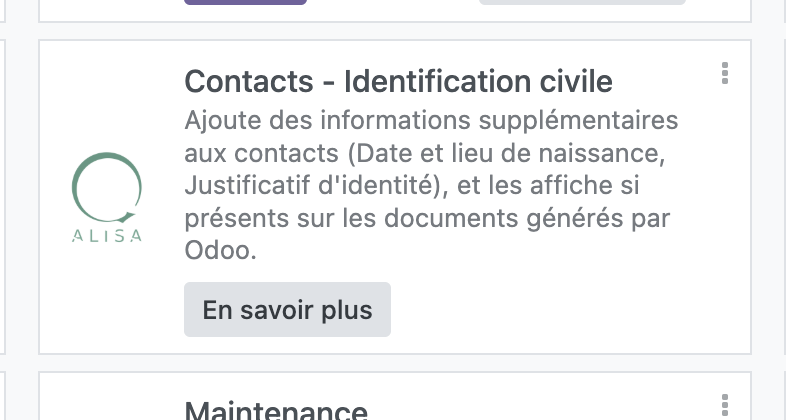
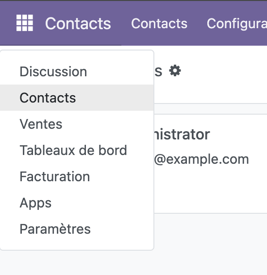
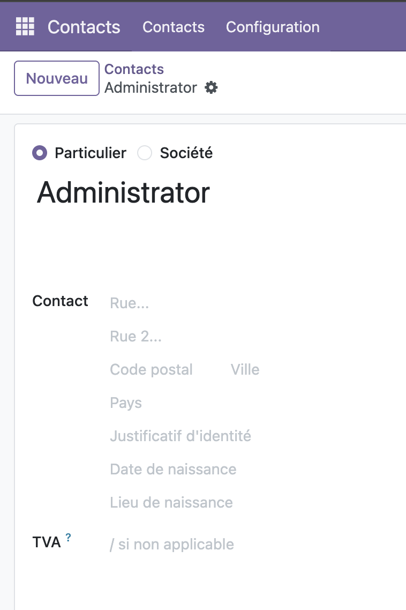
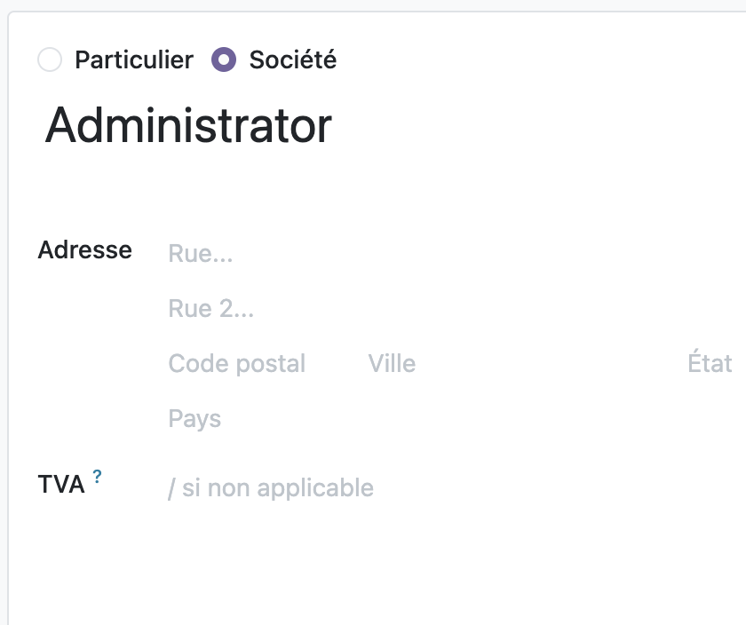
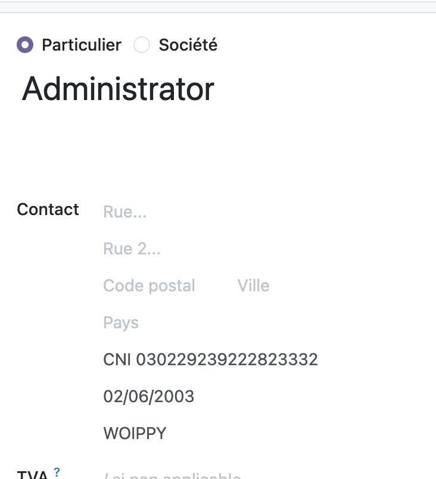
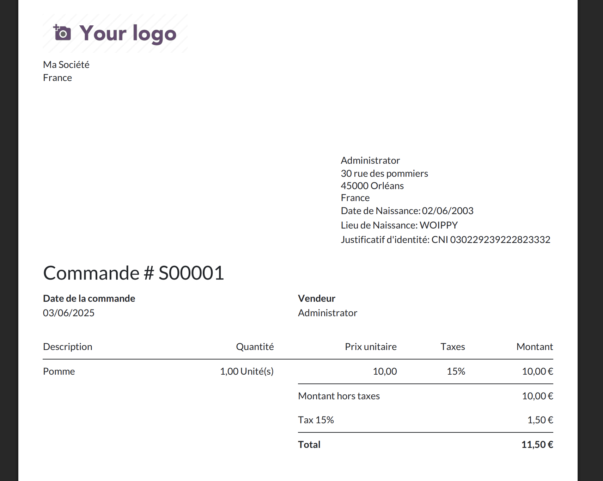

## Je souhaite faire apparaître le justificatif d'identité fourni par le clients sur mes factures / avoirs

:::tip
Assurez-vous que le module ci-dessous est disponible et bien installé sur votre logiciel Odoo (Menu > Apps):

:::

### Côté Saisie

Rendez vous dans Menu > Contacts:

Puis cliquez sur le client dont vous souhaitez ajouter un justificatif. Vous retrouverez les champs:

- Lieu de naissance
- Date de naissance
- Justificatif d'identité

:::warning
Attention, les clients de type "Société" n'ont pas à disposition ces champs !

:::

Voilà à quoi une saisie classique ressemble:

:::tip
Dans le cadre du justificatif d'identité, s'agissant d'un champ texte libre, indiquez systématiquement en 1er la nature de la pièce d'identité fournie (CNI, Titre de séjour, Permis...),
puis le numéro d'identification adossé.
:::

### Côté Restitution

Vous retrouverez, sur vos devis / avoirs / factures, imprimées ou au format PDF, la trace de ces informations:

