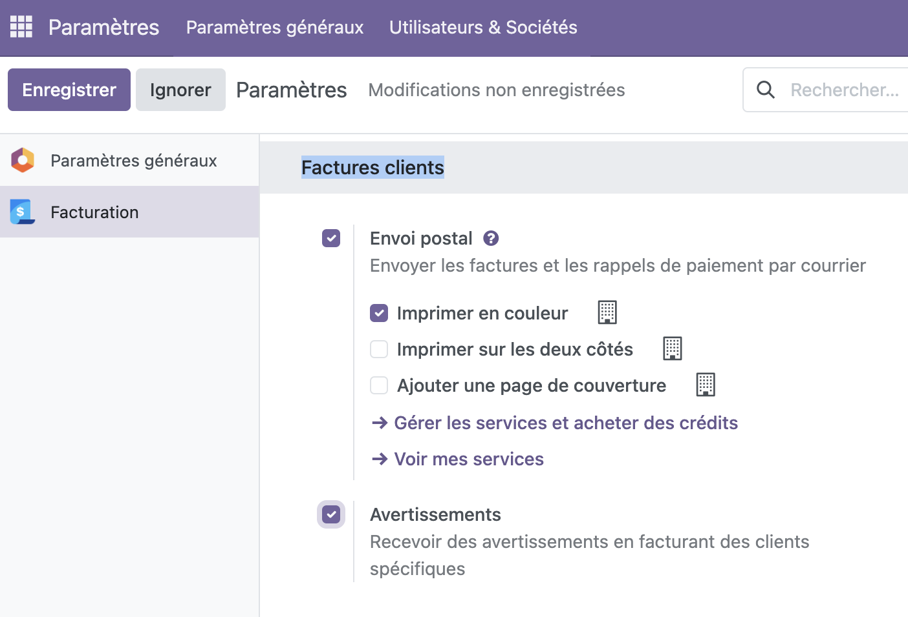

Si vous rencontrez des problèmes avec certains clients (escroquerie, vol...), vous pouvez positionner des alertes sur ceux-ci 
afin de vous avertir lors de devis / ventes.

:::tip
Pour bénéficier des fonctionnalités liées aux avertissements, assurez vous que l'option est activée dans `Menu > Paramètres > Facturation > Factures clients > Avertissements`.

:::

