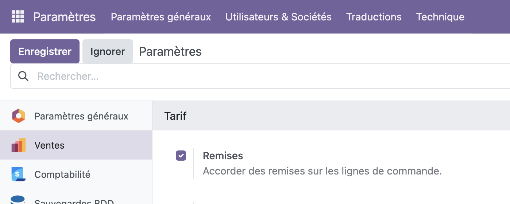
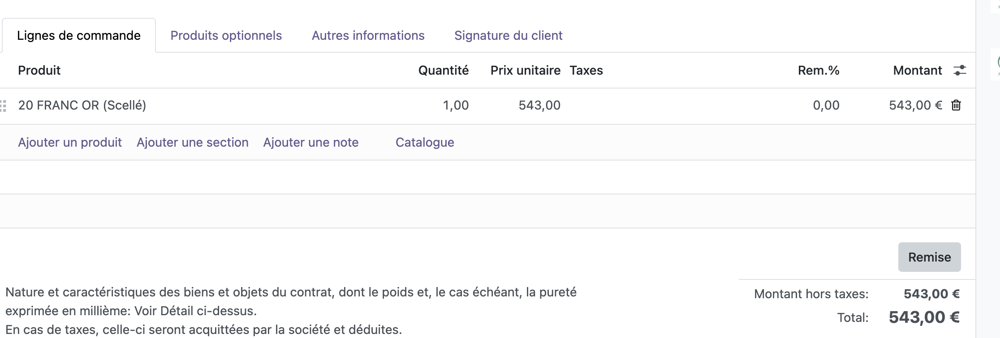
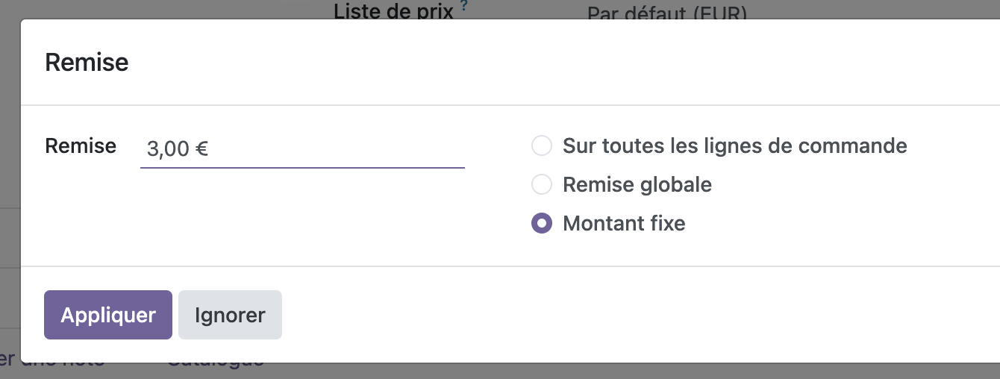
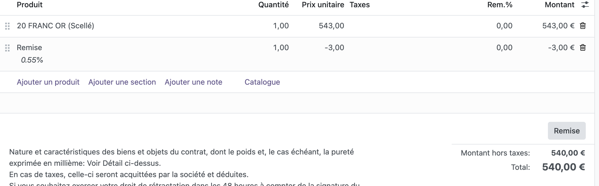
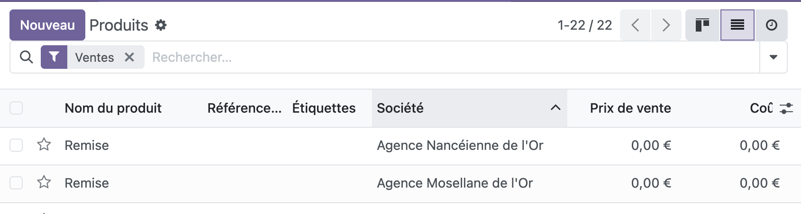

:::tip
Assurez-vous d'avoir "Menu > Paramètres > Ventes > Tarif > Remises" coché !

:::

## Je souhaite faire un prix rond / geste à mon client

Créez votre devis classiquement. Vous devriez retrouver le bouton "Remise" à côté du total de votre devis:

Ensuite selectionnez le type de remise à appliquer; classiquement "Montant Fixe" - Puis le montant, et enfin "Appliquer":

La remise sera alors automatiquement comptabilisée comme nouvelle ligne de facture, mais avec un montant négatif:

:::tip
Au niveau du logiciel, "Remise" correspond à un produit que vous pourrez retrouver dans votre liste des produits (Menu > Ventes > Produits > Produits).
Vous pouvez également le positionner manuellement, comme n'importe quel produit.
Si vous en trouvez plusieurs, c'est surement parce que vous êtes en multi-établissement: pour une traçabilité commerciale + fine, chacun aura le sien.

:::