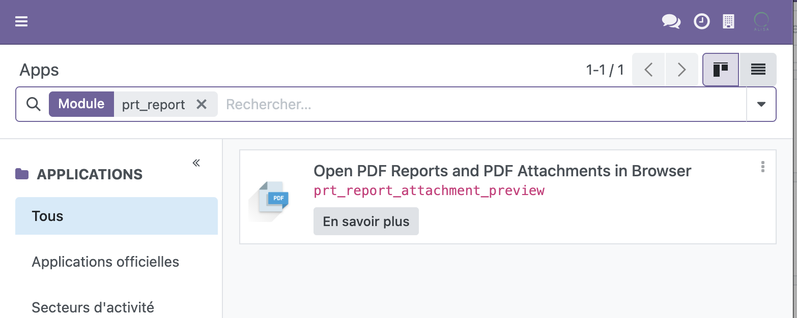
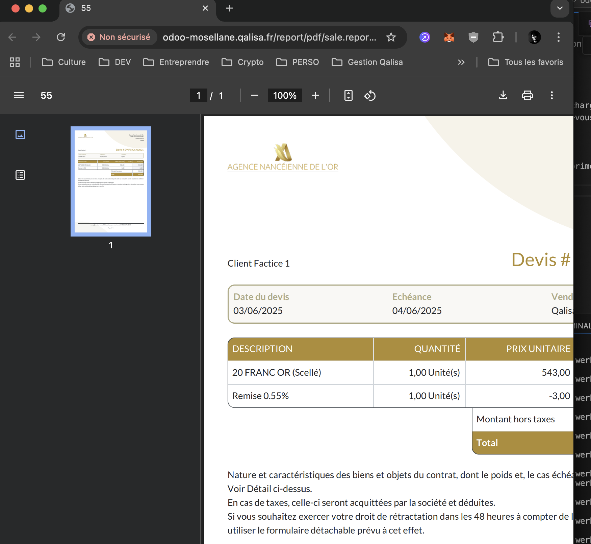

Par défault dans Odoo, les PDF sont téléchargés directement dans votre dossier "Téléchargements", mais pas prévisualisés dans le navigateur; 
c'est bien moins pratique à l'usage au quotidien.

Pour pouvoir prévisualiser vos documents dans notre navigateur, et pouvoir ensuite décider de le télécharger ou de l'imprimer, il faut installer un addon à votre
logiciel Odoo.

Pour avoir accès à cette option, assurez-vous que cet addon soit disponible et installé dans (Menu > Apps):

Ensuite, classiquement, téléchargez / imprimez vos documents (factures, avoirs, devis...); ils devraient normalement apparaître dans leur fenêtre à part:

:::tip
Si cet addon n'est pas disponible sur votre Odoo, contactez Qalisa.
:::