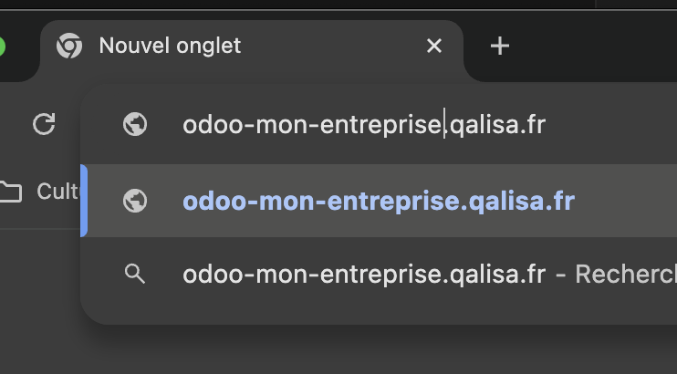

Odoo est une application Web et nécessite donc une connexion à Internet ainsi que d'un navigateur pour fonctionner.
Qalisa vous fournira en toute logique un lien vers votre instance Odoo, ainsi que des identifiants de connexion.
En cas de problème, n'hésitez pas à contacter le support Qalisa (contact@qalisa.fr).

## Versions proposées par Qalisa
Il existe plusieurs version d'Odoo proposés à la vente par Qalisa.

### Odoo On-Premise (sinon appelée "installation sur site")
Il s'agit de la version d'Odoo que vous hébergez dans vos propres locaux, et la solution généralement recommandée par Qalisa.
Votre logiciel Odoo se trouve sur l'ordinateur sans écran (appelé "Serveur") spécialement préparé et mis en réseau par Qalisa.

:::node
Si vous n'avez pas encore reçu votre serveur et qu'il n'a pas encore été installé, 
il y a de fortes chances que Qalisa vous ait ouvert un accès à votre logiciel en mode [Cloud](#odoo-sur-le-cloud-qalisa). 
Lorsque votre serveur sera prêt et installé, Qalisa s'occupera alors de la bascule sur votre serveur.
:::

### Odoo sur le Cloud Qalisa

Il s'agit de la version d'Odoo hébergée sur les serveurs de Qalisa. 
Pour y accéder, tapez simplement l'adresse communiquée par Qalisa dans votre barre de recherche.
 

:::tip
Lancez votre navigateur favori (Chrome, Firefox, Edge, etc.)

Remplacez `mon-entreprise` par le nom de votre entreprise. Celui-ci vous a été communiqué par Qalisa.
:::

## Reconnaître votre instance Odoo

Qalisa a paramétré Odoo afin qu'il affiche le logo de votre entreprise lors de votre 1er accès.
Ci-dessous, un exemple de ce que vous pourriez voir si vous étiez de l'enreprise Qalisa :

Vous êtes alors prêt à vous connecter.