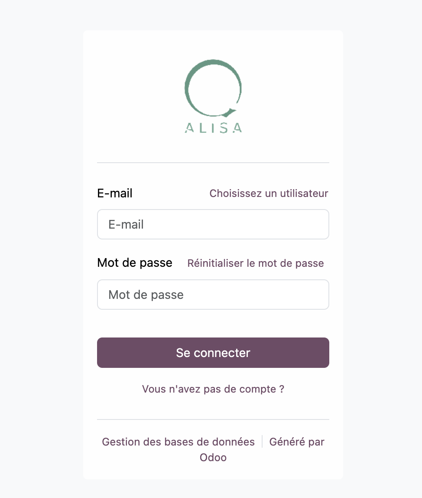

Afin d'accéder à votre logiciel, il vous faudra disposer de vos identifiants de connexion qui vous ont été préalablement communiqués par Qalisa.
Ils prendront la forme d'un nom d'utilisateur (en général, une adresse mail) ainsi que d'un mot de passe.
Si ces informations ne vous ont pas été transmises, n'hésitez pas à contacter le support Qalisa (contact@qalisa.fr).

:::caution
Une fois connecté, nous vous conseillons fortement de changer ce mot de passe choisi par Qalisa afin de concerver vos informations en sécurité ([Voyez plus bas](#changer-votre-mot-de-passe)).
:::

## 1ère connexion

Arrivé sur la page d'accueil, saisissez vos identifiants comme ci-dessous:

Puis cliquez sur le bouton `Se connecter`.

:::tip
Il est possible que votre navigateur vous propose de sauvegarder vos identifiants pour une connexion plus rapide ultérieurement.

:::

### Connexion réussie

Vous devriez alors arriver sur la boîte de réception de votre logiciel, comme illustré:

### Erreur de connexion

En cas d'erreur de connexion, vous allez alors constater cet écran:

Assurez vous d'avoir bien saisi vos identifiants, et n'hésitez pas à contacter le support Qalisa si le problème persiste.

### Changer votre mot de passe

Chez Qalisa, nous insistons particulièrement sur les bonnes pratiques de sécurité. 
C'est pourquoi nous vous recommandons de changer votre mot de passe dès votre première connexion.

Une fois connecté, repérez la petite icône de portrait en haut à droite de l'écran:

Cliquez dessus, puis sur `Mon profil`.

Une fois sur votre profil, descendez plus bas pour trouver l'onglet `Sécurité du compte`:

Puis, cliquez sur le bouton `Modifier mon mot de passe`:

Une nouvelle fenêtre devrait apparaître, vous demandant de confirmer votre mot de passe actuel. Saisissez le, puis cliquer sur `Confirmer le mot de passe`:

Ensuite, vous pourrez saisir votre nouveau mot de passe :

Pour confirmer, cliquez sur le bouton `Modifier le mot de passe`.

:::note[Concernant la robustesse de votre nouveau mot de passe]
Préférez en général des mots de passe de 8 à 12 caractères, comprenants des chiffres, lettres (majuscules et minuscules) 
et avec caractères spéciaux faciles d'accès (comme `.`, `@`, `$`...).
Evitez les espaces.
:::

#### Optionnel: Renforcez la sécurité avec l'authentication en 2 étapes

Pour renforcer votre sécurité, Odoo vous propose également la possibilité d'utiliser la vérification en 2 étapes (aussi appelée `2FA`).
Si vous souhaitez l'activer, Cliquez sur la glissère ci-dessous dans l'onglet `Sécurité du compte` de votre profil.

### Changer d'utilisateur

Pour pouvoir changer d'utilisateur, il faudra vous déconnecter dans un 1er temps.

Cliquez sur votre portrait en haut à droite: 

Puis, cliquez sur `Se déconnecter`.

Vous devriez retomber sur la page d'accueil de 1ère connexion.

